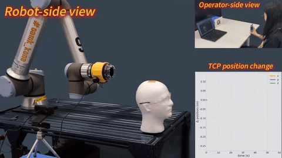
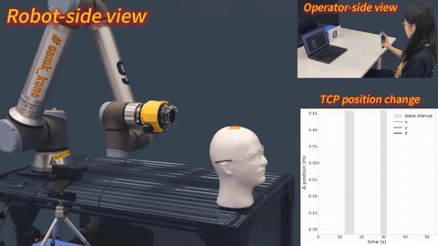
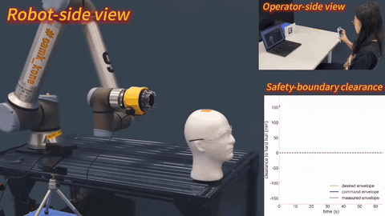
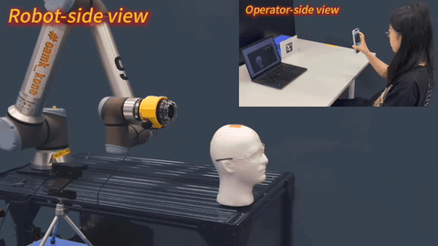

# Robottinen hiustenleikkaus

Kielet: [English](../README.md) | [中文](README.zh.md) | Suomi | [Deutsch](README.de.md) | [Français](README.fr.md)

Tämä arkisto tarjoaa tietosanakirjamaisen yleiskatsauksen robottiseen hiustenleikkaukseen. Se kattaa alan taustan, historian, turvallisuusnäkökohdat, sovellukset, tekniset haasteet ja keskeiset viitteet. Aiheeseen liittyviin julkaisuihin viitataan tekstissä, ja ne on koottu tämän sivun loppuun. Arkisto sisältää myös projektin yleisesittelyn [Haircutting Robot Introduction Slides](../haircutting_robot_introduction.pdf) -esityskalvoissa, jotka käsittelevät motivaatiota, aiempaa tutkimusta, teknisiä vaatimuksia, turvallisuutta, mahdollistavia teknologioita ja tulevaisuuden näkymiä.

## Yleiskuva

Robottinen hiustenleikkaus tarkoittaa robottijärjestelmien käyttöä hiustenleikkaustehtävien avustamiseen tai suorittamiseen. Ala kattaa esimerkiksi trimmauksen, parranajon, hiusten muotoilun ja muut vastaavat hoitotoimet. Näihin tehtäviin suunniteltuja robottialustoja kutsutaan tavallisesti hiustenleikkausroboteiksi.

Ala sijoittuu robotiikan, tietokonenäön, liikesuunnittelun, manipuloinnin, ihmisen ja robotin vuorovaikutuksen, viestinnän, tietokonegrafiikan, virtuaalitodellisuuden, tekoälyn ja haptiikan risteyskohtaan.

Toisin kuin tavalliset sähköiset hiustenleikkuukoneet tai käsin käytettävät hoitotyökalut, robottiset hiustenleikkausjärjestelmät vaativat havainnointi-, suunnittelu- ja ohjauskykyä, jotta robotti voi asemoida leikkaus- tai hoitotyökalun suhteessa ihmisen päähän ja hiuksiin. Tehtävä on teknisesti haastava, koska hiukset ovat muodonmuutoksille alttiita, vaihtelevat suuresti yksilöiden välillä ja niitä käsitellään lähellä herkkiä anatomisia alueita, kuten korvia, silmiä, hiuspohjaa ja kasvoja.

Nykyiset järjestelmät vaihtelevat teleoperoiduista alustoista autonomisempiin konsepteihin. Tähän arkistoon koottujen vuoden 2025 julkaisujen perusteella mitään täysin kaupallista hiustenleikkausrobottia ei kuvata laajasti käyttöönotetuksi, vaikka tutkimusprototyypit ja katsausartikkelit viittaavat uskottavaan kaupallistumispolkuun.

## Historia

### Varhaiset automaattiset hiustenleikkauslaitteet

Ajatuksia automaattisesta hiustenleikkauksesta esitettiin jo ennen nykyaikaisia robottijärjestelmiä. [Jean Gronierin](#ref-gronier-1966) vuonna 1966 saama yhdysvaltalainen patentti kuvasi automaattista hiustenleikkauskonetta, joka tuotti ennalta määrätyn kampauksen ohjelmoidun ohjauksen avulla. Sitä on tarkoituksenmukaisempaa pitää esirobottisena automaationa kuin modernina robottisena hiustenleikkausjärjestelmänä, koska se perustui mekaaniseen rakenteeseen ja ennalta määrättyihin ohjelmiin eikä reaaliaikaiseen havainnointiin tai adaptiiviseen palautteeseen.

Myöhemmät patentit ehdottivat integroidumpia järjestelmiä, joissa yhdistyivät havainnointi, robottimekanismit ja käyttöliittymät. Tämä kuvastaa siirtymää kohti selkeämmin robotillisia toteutuksia, mukaan lukien myöhempi [Mubarak Aldabbahin](#ref-aldabbah-2023) patentti.

### Kameralla avustetut itseleikkausjärjestelmät

Toinen tutkimussuunta keskittyi siihen, miten ihmisiä voitaisiin auttaa leikkaamaan omat hiuksensa sen sijaan, että robotti suorittaisi leikkauksen itsenäisesti. Vuonna 2014 [Futami, Terada ja Tsukamoto](#ref-futami-2014) esittivät liikkuvalla kameralla varustetun robottijärjestelmän, jonka avulla käyttäjä saattoi tarkastella päätään eri kuvakulmista itseleikkauksen aikana.

### Robottiset hiustenleikkausprototyypit

2020-luvulla useat julkiset demonstraatiot ja tee-se-itse-prototyypit kiinnittivät huomiota robottisen hiustenleikkauksen konsepteihin. Nämä hankkeet yhdistivät mekaanisen toimilaitetekniikan, anturoinnin ja ihmisen valvonnan, mutta ne pysyivät kokeellisina demonstraatioina eivätkä olleet validoituja tai kaupallisesti käyttöön otettuja järjestelmiä. Sama ero tuodaan esiin myös teoksessa [Shuai Li (2025)](../publications/2025/Haircutting_Robots_from__Theory_to_Practice.pdf).

### Lähialueen hiustenhoito- ja muotoilurobotit

Useat akateemiset järjestelmät ovat tutkineet hiustenleikkauksen lähitehtäviä, kuten shampoopesua, hiuspohjan hierontaa, harjausta, kampausta, takutuksen poistoa ja otsahiusten muotoilua. Vaikka nämä järjestelmät eivät välttämättä leikkaa hiuksia, ne käsittelevät monia samoja teknisiä kysymyksiä, kuten muodonmuutoksille alttiiden hiusten havainnointia, kontaktirikkaita manipulointitehtäviä, polkusuunnittelua, käyttäjämukavuutta ja turvallisuutta pään lähellä ([Ando ym., 2013](#ref-ando-2013); [Hughes ym., 2021](#ref-hughes-2021); [Dennler ym., 2021](#ref-dennler-2021); [Yoo ym., 2024](#ref-yoo-2024); [Kim ym., 2025](#ref-kim-2025)).

Esimerkkejä ovat hiustenpesu- ja päänhoitorobotit, palautteeseen perustuvat takutuksenpoistojärjestelmät, robottikampausalustat, MOE-Hairin kaltaiset pehmeät hiustenkäsittelyjärjestelmät sekä otsahiusten muotoilurobotit, jotka perustuvat hiussuortuvien juurikeskeiseen säätöön.

### Digitaaliset kampausten mallinnus- ja simulointijärjestelmät

Fyysisten robottijärjestelmien lisäksi digitaaliset kampausten mallinnus- ja simulointityökalut tarjoavat tärkeän vertailukohdan robottiselle hiustenleikkaukselle. [Digital Salon](#ref-he-2025-digital-salon) on tekoälyyn ja fysiikkaan perustuva järjestelmä 3D-hiusten generointiin, interaktiiviseen muotoiluun, reaaliaikaiseen simulointiin ja kuvien renderöintiin. Se tukee tavoitekampausten luomista luonnollisella kielellä ja mahdollistaa kampausten tarkentamisen ja simuloinnin kolmiulotteisessa ympäristössä. Vaikka järjestelmä ei suorita fyysistä hiustenleikkausta, se osoittaa, miten käyttäjän kieli, tavoitekampauksen määrittely, suortuvatason mallinnus, interaktiivinen muokkaus ja visuaalinen esikatselu voidaan yhdistää yhtenäiseksi työnkuluksi. Siksi se on relevantti tavoitekampausten esittämisen, simulointipohjaisen validoinnin ja ihmisen ja robotin vuorovaikutusrajapintojen kannalta robottisessa hiustenleikkauksessa.

### Akateeminen kehitys

2020-luvulla robottinen hiustenleikkaus alkoi hahmottua omaksi tutkimusaiheekseen palvelurobotiikassa ja henkilökohtaisen hoivan automaatiossa. Varhaiset monografiat ja katsausartikkelit kuvasivat hiustenleikkausta monitieteisenä insinööriongelmana, johon sisältyvät havainnointi, muodonmuutoksille alttiiden kohteiden mallinnus, liikesuunnittelu, ohjaus, teleoperointi, ihmisen ja robotin vuorovaikutus sekä turvallisuus. Nämä työt korostivat myös pään lähellä toimimisen vaikeutta, mukaan lukien hiusgeometrian epävarmuus, käyttäjien välinen vaihtelu ja tarve tiiviisti integroiduille havainnointi-suunnittelu-ohjausputkille. Samalla ne esittivät laajempia käsitteellisiä näkökulmia, joissa robottista hiustenleikkausta tarkastellaan esimerkiksi CNC-tyyppisenä prosessina tai liikkuvan robotin kattavuustehtävänä, johon liittyy turvallisuusrajoitteita kriittisten alueiden ympärillä ([Li, 2025](../publications/2025/Haircutting_Robots.pdf); [Shuai Li, 2025](../publications/2025/Haircutting_Robots_from__Theory_to_Practice.pdf); [Khan ja Li, 2026a](../publications/2026/CNC_Inspired_Robotic_Hair_Cutting_A_Comprehensive_Survey_on_Precision_Personal_Care_Automation.pdf); [Khan ja Li, 2026b](../publications/2026/Robotic_Haircutting_Systems_A_Survey_of_Methods_Challenges_and_Hair_Modeling_Insights.pdf)).

Hiljattain *International Journal of Systems Science* -lehdessä julkaistu artikkeli kehittää tätä liikkuvan robotiikan näkökulmaa robottisiin hiustenleikkausjärjestelmiin ([Huang, Khan ja Li, 2026](https://doi.org/10.1080/00207721.2026.2687894)).

Uudempi tutkimus on lisäksi yhdistänyt robottisen hiustenleikkauksen visio-kieli-toiminta-arkkitehtuureihin ja käyttänyt sitä konkreettisena ympäristönä korkeamman tason järjestelmäälykkyyden, arvioinnin ja käyttöönoton tarkasteluun ([Khan ja Li, 2026c](../publications/2026/Vision_Language_Action_Modules_for_Intelligent_Haircutting_Robots__A_Position_Paper_on_Architectures_Evaluation_and_Future_Direction.pdf)).

### Tekoälyn tuottamat robottihiustenleikkausvideot

Vuoden 2025 lopulta alkaen generatiiviset tekoälyvideotyökalut vauhdittivat verkossa leviävää aaltoa kuvitteellisista robottihiustenleikkausvideoista. Videoissa esiintyi humanoidikampaajia, monivarsisia työasemia ja kypärämäisiä automaattisia hiustenleikkauslaitteita. Vaikka sisältö oli fiktiivistä, se lisäsi yleisön tietoisuutta ja heijasti kasvavaa kiinnostusta automatisoituun henkilökohtaiseen hoivaan.

## Turvallisuus

Turvallisuus on robottisessa hiustenleikkauksessa keskeinen kysymys, koska robotti toimii ihmisen pään lähellä käyttäen työkaluja, kuten leikkureita, saksia, partakoneita, kuivauslaitteita tai lämpeneviä muotoilutyökaluja. Keskeisiä vaaratekijöitä ovat havainnointivirheet, pään odottamaton liike, liian suuri kontaktivoima, työkalun ylikuumeneminen, leikkaustyökalun virheellinen kohdistus, kalibrointivirheet, viive teleoperoinnissa sekä ohjelmisto- tai ohjausviat.

Ehdotettuja turvallisuustoimenpiteitä ovat työtilan rajaukset, nopeus- ja kiihtyvyysrajoitteet, voima- tai painerajat, joustavat mekanismit, pehmeät suojukset tai pääte-efektorit, hätäpysäytys, lähialueen valvonta, redundantti anturointi sekä toiminnan automaattinen keskeyttäminen vaaratilanteissa.

Robottiselle hiustenleikkaukselle ei ole olemassa omaa kansainvälistä turvallisuusstandardia. Useat olemassa olevat standardit tarjoavat kuitenkin hyödyllisiä viitepisteitä riskianalyysiin ja järjestelmäsuunnitteluun, erityisesti [ISO 13482](#ref-iso-13482), [ISO/TS 15066](#ref-iso-ts-15066), [ISO 10218-1](#ref-iso-10218-1) ja [ISO 14971](#ref-iso-14971). Hiustenleikkaukseen liittyviä vaaraluokkia, lieventämisstrategioita ja näiden standardien merkitystä tarkemmalle riskianalyysille käsitellään julkaisussa [Shuai Li (2025)](../publications/2025/Haircutting_Robots_from__Theory_to_Practice.pdf) sekä [vuoden 2026 turvallisuuskatsauksessa](https://doi.org/10.1002/rob.70305).

## Haasteet ja tutkimussuunnat

Keskeisiin haasteisiin kuuluvat hiusten ja hiuspohjan luotettava havainnointi, erilaisten hiustyyppien mallintaminen, käyttäjän liikkeen kompensointi, turvallisten työkaluratojen suunnittelu, sopivan etäisyyden ja kontaktivoiman ylläpitäminen sekä toimiminen herkkien alueiden, kuten korvien, silmien, kasvojen ja hiuspohjan, lähellä.

Hiuksia on erityisen vaikea käsitellä, koska ne ovat muodonmuutoksille alttiita, suortuvapohjaisia ja hyvin vaihtelevia pituuden, tiheyden, kiharuuden, jäykkyyden ja kosteuden suhteen. Vaikka geometrinen tarkkuus olisi korkea, esteettinen arviointi on edelleen vaikeaa, koska hiustenleikkauksen laatu riippuu myös tyylitoiveista, symmetriasta, mukavuudesta ja käyttäjän odotuksista.

Muita haasteita ovat pitkäaikainen toiminta, kustannusten kohtuullisuus, sertifiointi, vastuuasiat, käyttäjien hyväksyntä, yksityisyys ja datan käsittely. Kameraan tai kolmiulotteiseen skannaukseen perustuvat järjestelmät voivat kerätä kasvo-, hiuspohja- tai kampausdataa, mikä aiheuttaa yleisten turvallisuuskysymysten lisäksi yksityisyyshaasteita.

Nämä haasteet osoittavat useita lupaavia tutkimussuuntia robottisessa hiustenleikkauksessa:

- Autonominen hiustenleikkaus
- Teleoperointiin perustuva hiustenleikkaus etäasiantuntijan ohjaukseen
- Jaetun autonomian järjestelmät, joissa yhdistyvät ihmisen valvonta ja robotin suoritus
- Hiustenleikkauksen suunnittelu tavoitekampausten, geometristen määritysten tai käyttäjäohjeiden perusteella
- 3D-hiusten mallinnus ja fysikaalinen simulointi tavoitekampausten luomista, digitaalista esikatselua ja robotin suorituksen validointia varten
- Hiusten, hiuspohjan ja pään asennon reaaliaikainen havainnointi leikkauksen aikana
- Käyttäjän liikkeen ja muiden häiriöiden kompensointi toiminnan aikana
- Turvallisuustietoinen ohjaus herkkien anatomisten alueiden lähellä toimimiseen
- Arviointiprotokollat, benchmark-menetelmät ja sertifiointiin suuntautunut järjestelmäsuunnittelu
- Käyttöönottoon suuntautunut järjestelmäintegraatio luotettavaa todellista käyttöä varten

## Käynnissä oleva työ

Tähän arkistoon koottujen julkaisujen lisäksi tämän arkiston taustalla oleva tiimi kehittää etäohjattua teleoperoitua hiustenleikkausrobottijärjestelmää seuraavan julkisen projektin kautta:

- [Client_RHCR](https://github.com/Dai0731csc/Client_RHCR): asiakaspuolen järjestelmä etäohjattua teleoperoitua robottista hiustenleikkausta varten. Se tukee selainpohjaista havainnointia, kalibrointia, viestintää ja raakaa pose-suoratoistoa. Aiheesta kiinnostuneet tutkijat ja kehittäjät ovat tervetulleita osallistumaan.

### Teleoperointidemonstraatiot

| Normaali toiminta [\[9\]](#team-publication-9) | Rebase-toiminta [\[9\]](#team-publication-9) |
| --- | --- |
|  |  |

| Turvallisuusvalvoja [\[8\]](#team-publication-8) | Hätäseis [\[9\]](#team-publication-9) |
| --- | --- |
|  |  |

Tämän tiimin muut käynnissä olevat työt on koottu tiedostoon [../ongoing-work/README.md](../ongoing-work/README.md).

## Opetus ja koulutus

Tutkimusjulkaisujen ja toteutustyön lisäksi tämä arkisto kokoaa myös robottiseen hiustenleikkaukseen liittyviä opetus- ja koulutusmateriaaleja. Nämä resurssit on järjestetty tiedostoon [../education/README.md](../education/README.md).

- [Capstone Weekly Planning 2026](../education/Capstone%20Weekly%20Planning_2026.pdf): kurssiprojektin suunnitteludokumentti opiskelijoiden koulutusta ja projektiosallistumista varten.

## Kysymyksiä ja vastauksia (Q&A)

Yllä olevan yleiskatsauksen lisäksi tämä arkisto kokoaa robottiseen hiustenleikkaukseen liittyviä kysymys-vastausmateriaaleja hakemistoon [../Q&A/](../Q&A/).

Aineisto kokoaa opiskelijoiden ja osallistujien vastaukset projektikyselyyn sekä tutkimustiimin lyhyet taustahuomautukset. Käsitellyt aiheet ovat muun muassa seuraavat:

- kaupallistumisen näkymät ja käyttöönottoaikataulut
- tekoäly ja havainnointi robottisessa hiustenleikkauksessa
- mekaaninen rakenne, työkalut ja turvamekanismit
- ohjaus, liikesuunnittelu ja trajektorioiden muodostus
- markkinapotentiaali, käyttäjien luottamus ja jaettu autonomia
- muut avoimet kysymykset ja jatkokeskustelu

- [Q & A about haircutting robots](../Q&A/Q%20%26%20A%20about%20haircutting%20robots.pdf): yllä olevia aiheita käsittelevä kysymys-vastauskokoelma.

## Aiheeseen liittyvät projektit ja työkalut

Tähän aihepiiriin liittyvät viiteprojektit ja työkalut on järjestetty luokittain tiedostossa [../related-projects/README.md](../related-projects/README.md). Tämä hakemisto toimii laajennettavana viitekokoelmana teknisistä perusteista, jotka liittyvät robottisen hiustenleikkauksen laajempaan tutkimukseen.

## Viitteet

- Jean Gronier. *Automatic hair-cutting machine having programmed control means for cutting hair in a predetermined style*. US Patent 3241562A, 1966. [[link](https://patents.google.com/patent/US3241562A/en)]
- Mubarak Aldabbah. *Automatic hair cutter robot*. WO Patent 2023080812A1, 2023. [[link](https://patents.google.com/patent/WO2023080812A1/en)]
- Kyosuke Futami, Tsutomu Terada, and Masahiko Tsukamoto. *A System for Supporting Self-Haircuts Using Camera Equipped Robot*. MoMM, 2014. [[link](https://doi.org/10.1145/2684103.2684143)]
- Takeshi Ando et al. *Biosignal-based relaxation evaluation of head-care robot*. EMBC, 2013. [[link](https://doi.org/10.1109/embc.2013.6611101)]
- Josie Hughes et al. *Detangling hair using feedback-driven robotic brushing*. RoboSoft, 2021. [[link](https://doi.org/10.1109/RoboSoft51838.2021.9479221)]
- Nathaniel Dennler, Eura Shin, Maja Mataric, and Stefanos Nikolaidis. *Design and Evaluation of a Hair Combing System Using a General-Purpose Robotic Arm*. IROS, 2021. [[link](https://doi.org/10.1109/IROS51168.2021.9636768)]
- Uksang Yoo et al. *MOE-Hair: Toward Soft and Compliant Contact-rich Hair Manipulation and Care*. HRI Companion, 2024. [[link](https://doi.org/10.1145/3610978.3640682)]
- Soonhyo Kim et al. *Front Hair Styling Robot System Using Path Planning for Root-Centric Strand Adjustment*. SII, 2025. [[link](https://doi.org/10.1109/SII59315.2025.10871088)]
- Chengan He et al. *Digital Salon: An AI and Physics-Driven Tool for 3D Hair Grooming and Simulation*. arXiv:2507.07387, 2025. [[link](https://doi.org/10.48550/arXiv.2507.07387)][[code](https://github.com/Dai0731csc/Digital-Salon)]
- ISO 13482. *Robots and robotic devices - Safety requirements for personal care robots*.
- ISO/TS 15066. *Robots and robotic devices - Collaborative robots*.
- ISO 10218-1. *Robotics - Safety requirements for industrial robots - Part 1: Robots*.
- ISO 14971. *Medical devices - Application of risk management to medical devices*.

## Tiimin julkaisut

Tätä projektia johtaa Oulun yliopistossa [professori Shuai Li](https://www.oulu.fi/en/researchers/shuai-li), ja se keskittyy tällä hetkellä robottiseen hiustenleikkaukseen liittyvään tutkimukseen. Asiaankuuluvat julkaisut on mainittu yllä oikeissa kohdissa ja koottu tähän arkistoon. Ne on lueteltu alla.

### 2025

- [1] S. Li, *Haircutting Robots*. Cham, Switzerland: Springer, 2025. DOI: [10.1007/978-3-031-84026-5](https://doi.org/10.1007/978-3-031-84026-5). [PDF](../publications/2025/Haircutting_Robots.pdf).
- [2] S. Li, "Haircutting Robots: From Theory to Practice," *Automation*, vol. 6, no. 3, article 47, 2025. DOI: [10.3390/automation6030047](https://doi.org/10.3390/automation6030047). [PDF](../publications/2025/Haircutting_Robots_from__Theory_to_Practice.pdf).

### 2026

- [3] A. T. Khan and S. Li, "Robotic Haircutting Systems: A Survey of Methods, Challenges, and Hair Modeling Insights," *IEEE Journal of Selected Areas in Sensors*, vol. 3, pp. 104–112, 2026. DOI: [10.1109/JSAS.2026.3654480](https://doi.org/10.1109/JSAS.2026.3654480). [PDF](../publications/2026/Robotic_Haircutting_Systems_A_Survey_of_Methods_Challenges_and_Hair_Modeling_Insights.pdf).
- [4] A. T. Khan and S. Li, "CNC-Inspired Robotic Hair Cutting: A Comprehensive Survey on Precision Personal Care Automation," *Journal of Artificial Intelligence for Automation*, vol. 1, no. 1, article 2, 2026. DOI: [10.53941/jaia.2026.100002](https://doi.org/10.53941/jaia.2026.100002). [PDF](../publications/2026/CNC_Inspired_Robotic_Hair_Cutting_A_Comprehensive_Survey_on_Precision_Personal_Care_Automation.pdf).
- [5] A. T. Khan and S. Li, "Vision-Language-Action Models for Intelligent Haircutting Robots: A Position Paper on Architectures, Evaluation, and Future Directions," ResearchGate, position paper, 2026. DOI: [10.13140/RG.2.2.30849.62563](https://doi.org/10.13140/RG.2.2.30849.62563). [PDF](../publications/2026/Vision_Language_Action_Modules_for_Intelligent_Haircutting_Robots__A_Position_Paper_on_Architectures_Evaluation_and_Future_Direction.pdf).
- [6] Z. Huang, A. T. Khan, and S. Li, "Haircutting robots: a mobile robotics perspective," *International Journal of Systems Science*, pp. 1–20, 2026. DOI: [10.1080/00207721.2026.2687894](https://doi.org/10.1080/00207721.2026.2687894). [PDF](../publications/2026/Haircutting%20robots%20%20a%20mobile%20robotics%20perspective.pdf).
- [7] Z. Huang, A. Vilkki, S. Li, and J. Röning, "Safety in Robotic Haircutting," *Journal of Field Robotics*, pp. 1–25, 2026. DOI: [10.1002/rob.70305](https://doi.org/10.1002/rob.70305). [PDF](../publications/2026/Safety_in_Robotic_Haircutting.pdf).
- [8] Z. Huang, A. T. Khan, A. M. Mohammed, F. Lo Regio, J.-J. Torvinen, L. Angrisani, and S. Li, "A Safety Boundary Governor for Teleoperated Robotic Haircutting," conference submission, 2026. [PDF](../publications/2026/A%20Safety%20Boundary%20Governor%20for%20Teleoperated%20Robotic%20Haircutting.pdf).
- [9] Z. Huang, A. Vilkki, J. Huang, B. Liao, C. Luo, L. Angrisani, and S. Li, "TeleHairing: A Teleoperation Baseline for Robotic Haircutting," *arXiv preprint*, arXiv:2610.07096, 2026. DOI: [10.48550/arXiv.2610.07096](https://doi.org/10.48550/arXiv.2610.07096). [PDF](../publications/2026/TeleHairing.pdf).
