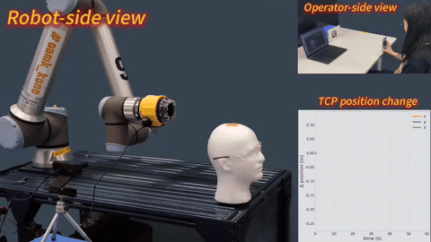
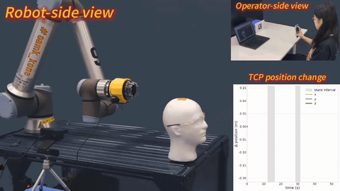
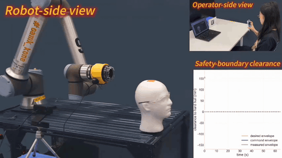
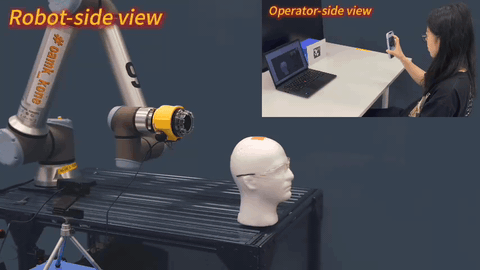

# Remote Teleoperated Haircutting Robot System

This page summarizes the current public implementation effort on the remote teleoperated haircutting robot system being developed by the team led by [Professor Shuai Li](https://www.oulu.fi/en/researchers/shuai-li) at the University of Oulu.

- [Client_RHCR](https://github.com/Dai0731csc/Client_RHCR): a client system for remote teleoperated robotic haircutting that supports browser-based perception, calibration, communication, and raw pose streaming.

## Demonstrations

These demonstrations illustrate the current teleoperation workflow and safety-related behaviors:

- Normal operation: robot-side motion follows the operator-side control input during a remote haircutting task.
- Rebase operation: the system updates the teleoperation reference frame to support continued operation.
- Safety governor: the safety-governor behavior constrains operation when the system approaches unsafe conditions.
- Emergency stop: the emergency-stop behavior interrupts operation immediately.

| Normal operation | Rebase operation |
| --- | --- |
|  |  |

| Safety governor | Emergency stop |
| --- | --- |
|  |  |

This page may later be extended with additional repositories, modules, demonstrations, or deployment-oriented system components from the same team.
